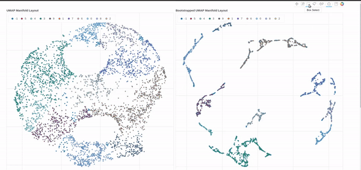

Datasets for scripts here are at https://doi.org/10.6084/m9.figshare.7416317.

To run the GUI ronch_rover.py based on Bokeh library:
```
bokeh serve --show ronch_rover.py
```


Citation: Li X, Dyck OE, Oxley MP, Lupini AR, McInnes L, Healy J, Jesse S, Kalinin SV. Manifold learning of four-dimensional scanning transmission electron microscopy. npj Computational Materials. 2019 Jan 7;5(1):5. DOI
https://doi.org/10.1038/s41524-018-0139-y
